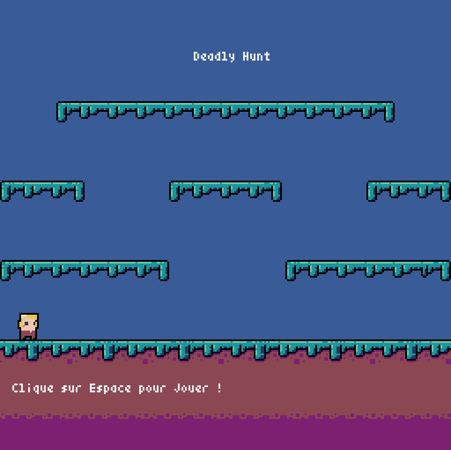

# Jouer

[Clique ici](https://osiris-sio.github.io/HTML_Ball-Challenge/) pour jouer sur le navigateur, que vous soyez sur PC ou Smartphone !
Vous pouvez également jouer hors ligne en installant game.html sur PC et Smartphone ([ici](https://github.com/Osiris-Sio/Ball-Challenge/blob/main/game.html)).

# Description 

Plongez dans l'action avec _Ball Challenge_, un jeu d'arcade addictif où votre agilité est mise à l'épreuve ! Évitez habilement les balles rebondissantes tout en collectant autant de pièces que possible. Affrontez vos propres records et défiez vos amis pour voir qui peut atteindre le plus haut score !

# Caractéristiques

 

* Esquivez les balles : Utilisez votre réflexe et votre rapidité pour éviter les balles qui rebondissent sur les murs.
* Collectez des pièces : Ramassez le plus de pièces pour accumuler des points.
* Défiez-vous : Testez vos compétences en tentant d'obtenir le meilleur score possible dans ce jeu rapide et stimulant.
* Graphismes rétro : Plongez dans une esthétique rétro avec des visuels charmants.
* Facile à jouer, difficile à maîtriser : Accessible à tous, mais assez difficile pour défier même les joueurs les plus expérimentés.

# Menu

1. Changer la plateforme. Permet de désactiver l'affichage de la souris et de prendre en charge le tactile. 
En mode PC, la croix directionnelle d'une manette est prise en compte.
2. Changer le nombre de balles pendant la partie. (1, 2 ou 3 balles)
3. Changer la couleur de la balle ou des balles (15 couleurs)
4. Changer le personnage (12 personnages)
5. Bouton pour lancer une partie.
6. La version du jeu.

# Partie

1. Votre personnage (8x8 pixels).
2. Une pièce qui doit être ramassée pour augmenter le score.
3. La balle qu'il faut éviter. Attention, elles rebondissent aléatoirement sur les murs.
4. Bouton pour retourner au menu.
5. Bouton pour relancer la partie.
6. Les informations de la partie. Cette zone indique le nombre de balles, le nombre de pièces ramassées et la durée (en secondes) de la partie.
7. Indication des touches à appuyer pour bouger votre personnage.

_Remarque :_

Pour le mode "Smartphone", l'indication des touches changera en une croix directionnelle tactile.

# Réseaux Sociaux

[Réseaux sociaux 🌍](https://linktr.ee/osiris_sio)

________

Par AMEDRO Louis (alias Osiris Sio)

Studio : I.V.L Games (Innovation, Vision and Liberty Games)

licence CC BY SA
