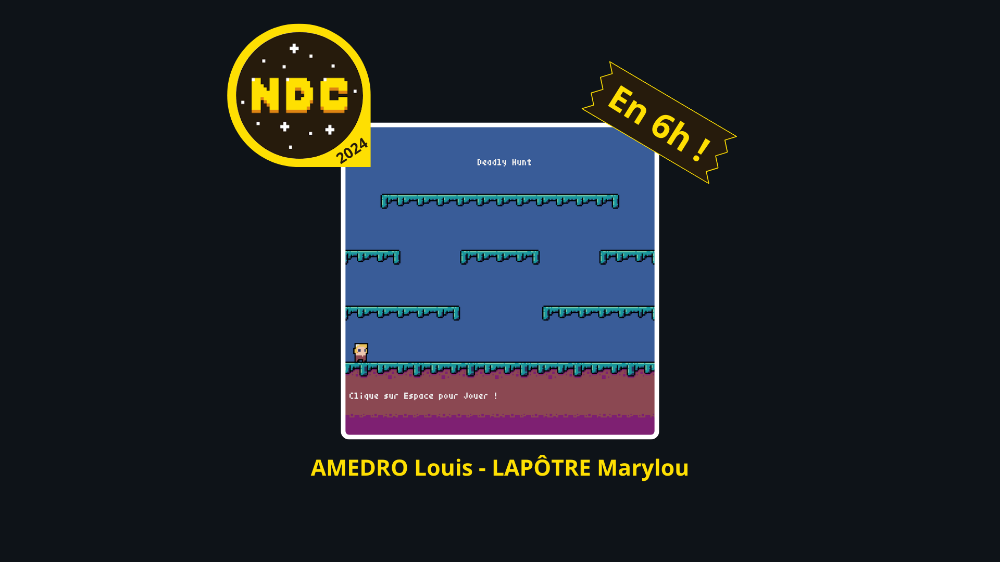

# Jouer

[Clique ici](https://osiris-sio.github.io/HTML_Deadly-Hunt/) pour jouer sur le navigateur, PC uniquement !
Vous pouvez également jouer hors ligne en installant game.html ([ici](https://github.com/Osiris-Sio/Ball-Challenge/blob/main/game.html)).

# Description 

Notre jeu "Deadly Hunt" est un jeu de plateforme. Vous pouvez contrôler votre personnage avec votre clavier : la touche Q permet de le déplacer
vers la gauche, la touche D permet de le déplacer vers la droite, pour sauter, il suffit d'appuyer sur la barre espace et grâce à la touche M, comme Meurtre,
vous pouvez tuer les monstres qui apparaissent. Votre mission, si toutefois vous l'acceptez, est de tuer le plus de monstres possible tout en récoltant des pièces pour
augmentez votre score. Bon amusement !

*Ce projet a été fait en 6h en Python avec le module Pyxel à l'occasion de la "Nuit du Code 2024".*
*Aucune mise à jour ou amélioration ne sera apportée.*

___

Our game "Deadly hunt" is a platform game. You can control your character with your keyboard: the Q key allows you to move it
to the left, the D key allows you to move it to the right, to jump, just press the space bar and using the M key, like Murder,
you can kill the monsters that appear. Your mission, if you accept it, is to kill as many monsters as possible while collecting coins to
increase your score. Have fun !

*This project was done in 6h in Python with the Pyxel module on the occasion of the "Nuit du Code 2024".*
*No updates or enhancements will be made.*

________

AMEDRO Louis (alias Osiris Sio)
LAPÔTRE Marylou

licence CC BY SA